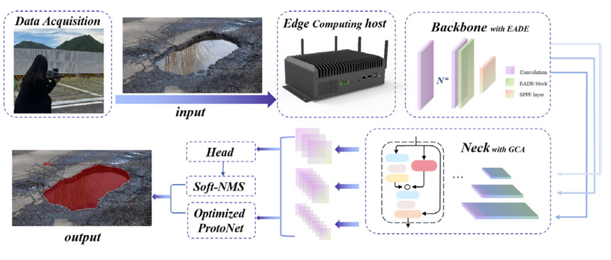
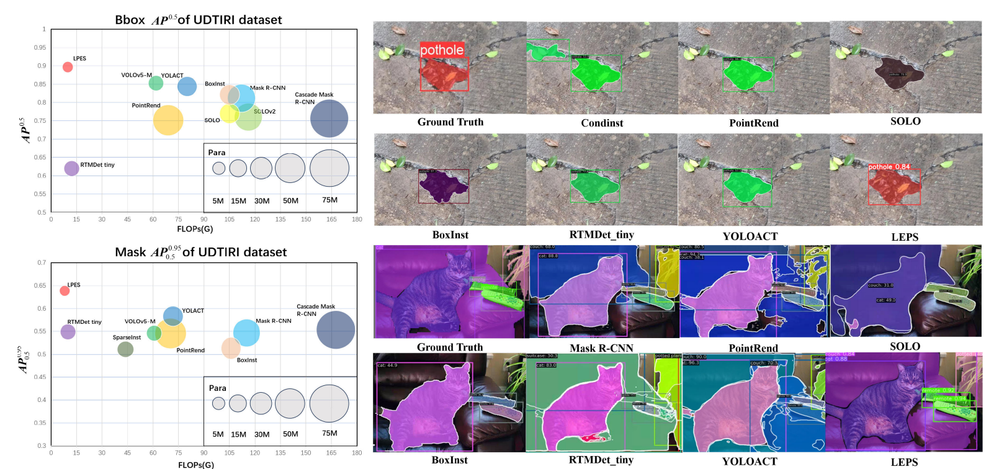

# [LEPS: A Lightweight and Effective Single-Stage Detector for Pothole Segmentation](https://ieeexplore.ieee.org/document/10315064)

A lightweight and effective instance segmentation method was proposed for road pothole detection, named the LEPS detector (Lightweight and Effective Pothole Segmentation).

<p align="center">

</p>
<b><p align="center" style="margin-top: -20px;">
Overall framework of LEPS </b></p>

[LEPS: A Lightweight and Effective Single-Stage Detector for Pothole Segmentation](https://ieeexplore.ieee.org/document/10782998).\
Xiaoning Huang, Jintao Cheng, Qiuchi Xiang, Jun Dong, Jin Wu, Rui Fan, Xiaoyu Tang
[![MIT License][license-shield]][license-url]

<details>
  <summary>
  <font size="+1">Abstract</font>
  </summary>
Currently, the problem of potholes on urban roads is becoming increasingly severe. Identifying and locating road potholes promptly has become a major challenge for urban construction. Therefore, a lightweight and effective instance segmentation method called lightweight and effective pothole segmentation (LEPS) detector was proposed for road pothole detection. To extract the image edge information and gradient information of potholes from the feature map more efficiently, a module that performs the convolutional superposition supplemented with a convolutional kernel was proposed to enhance spatial details for the backbone. LEPS has designed a novel module applied to the neck layer, improving the detection performance while reducing the parameters. To enable accurate segmentation of fine-grained features, the ProtoNet was optimized, which enables the segmentation head to generate high-quality masks for more accurate prediction. This article has fully demonstrated the effectiveness of the method through a large number of comparative experiments. This detector has excellent performance on two authoritative example datasets, URTIRI and COCO, and can successfully be applied to visual sensors to accurately detect and segment road potholes in real environments, and accurately LEPS reached 0.892 and 0.648 in terms of Mask for AP50 and AP50:95, which is improved by 4.6% and 20.6% compared with the original model. These results demonstrate its strong competitiveness when compared with other models. Comprehensively, LEPS improves detection accuracy while maintaining lightweight, which allows the model to meet the practical application requirements of edge computing devices.
</details>

## 📖How to use
### 📚Dataset

The UDTIRI dataset offers various formats for the road pothole detection task. The instance segmentation task dataset contains images of potholes captured under various lighting and road conditions. UDTIRI contains potholes of various sizes, ranging from the smallest pothole, which accounts for 0.3% of the image area, to the largest pothole, which accounts for 92.0%. This indicates that the pothole data can accurately represent the pothole situation in most real-life scenes.

Enter the address and label name of your data set in the [pothole.yaml](./ultralytics/datasets/pothole.yaml) which ensure that the dataset is used during the training process.

### 💾Environment
Our environment: Ubuntu 20.04, CUDA 11.4, NVIDIA RTX 3060 GPU.

Use conda to create the conda environment and activate it:
```shell
conda env create --name your_env_name python=3.8
conda activate your_env_name
pip install ultralytics
```
### 📈Training
Check the path in [train.py](./train.py), and run it to train:
```shell
python train.py 
```
### 📝Validation
Check the path in [val.py](./val.py).

```shell
python val.py
```

### 👀Performance

<p align="center">

</p>
<b><p align="center" style="margin-top: -20px;">
Left: performance of various models on the UDTIRI dataset across three dimensions: accuracy, computational complexity, and parameters. Right: detection result of different models (including ground truth) on the UDTIRI and
COCO datasets. </b></p>


## Acknowledgement

The code base is built with [ultralytics](https://github.com/ultralytics/ultralytics).

Thanks for the great implementations! 

## Citation

If our code or models help your work, please cite our paper:
```BibTeX
@ARTICLE{10315064,
  author={Huang, Xiaoning and Cheng, Jintao and Xiang, Qiuchi and Dong, Jun and Wu, Jin and Fan, Rui and Tang, Xiaoyu},
  journal={IEEE Sensors Journal}, 
  title={LEPS: A Lightweight and Effective Single-Stage Detector for Pothole Segmentation}, 
  year={2024},
  volume={24},
  number={14},
  pages={22045-22055},
  doi={10.1109/JSEN.2023.3330335}}
```

<!-- links -->
[license-shield]: https://img.shields.io/github/license/shaojintian/Best_README_template.svg?style=flat-square
[license-url]: https://github.com/shaojintian/Best_README_template/blob/master/LICENSE.txt


